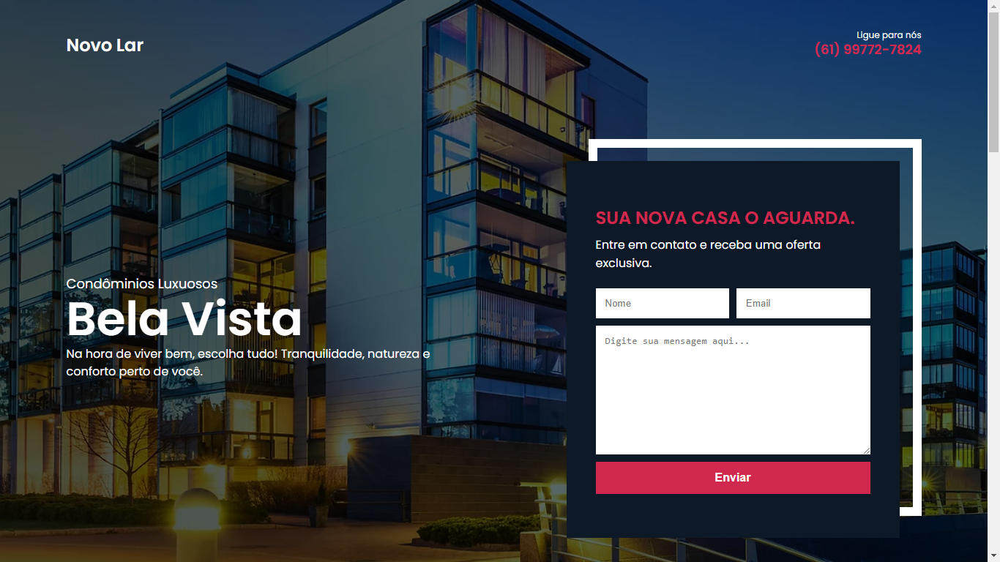
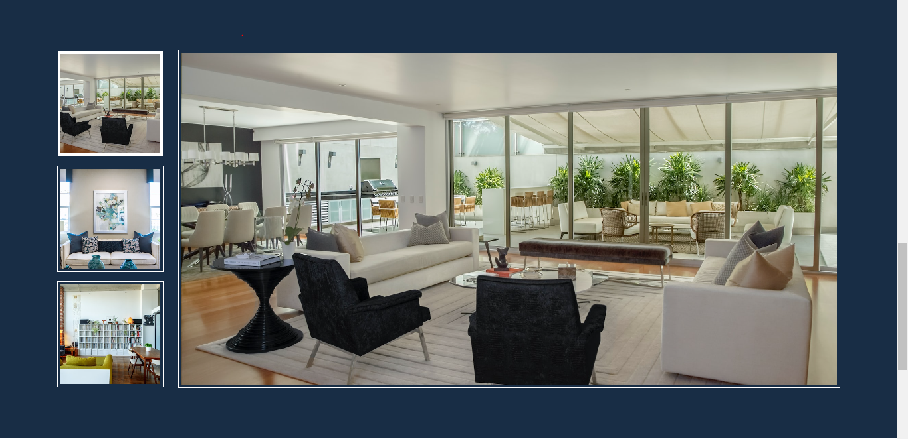

# Novo Lar

Landing page de uma corretora de imóveis.

Este pequeno projeto foi desenvolvido em HTML, CSS e Javascript. Não possui fins comerciais, mas sim colocar os conhecimentos adquiridos em prática.



<a rel="noopener" href="https://ailson12.github.io/novo-lar/" target="_blank">Demonstração Online</a>

## HTML
Com o HTML tive o cuidado para que fosse escrito o mais semântico possível, ou seja, suas tags com o objetivo de descrever o significado do conteúdo, o que ajuda nos mecanismos de pesquisa. Por exemplo: Header indicando o cabeçalho, footer representando o rodapé, etc.

## CSS
A estilização responsiva foi feita do zero, e esta contida em arquivos globais e locais.
 - Global
  Há dois arquivos globais que são cores e fontes, visto que são repetidos em vários pontos do sistema.
  
 - Local
  Os arquivos locais são destinados a estilização da seções.

## Javascript
Utilizei javascript para setar no rodapé o ano atual e também para manipular uma simples galeria.


 

### Tecnologias utilizadas
 - clean-css-cli - para minificar os arquivos css.

### Requisitos
  - Npm
  - NodeJs

### Instalação
  - Fazer o clone do projeto
  ```
    git clone https://github.com/Ailson12/novo-lar.git
  ```
  - Abrir a pasta do projeto e instalar os módulos da aplicação.
  ```
    npm install
  ```
   
### Desenvolvimento
Após instalar as dependências, o comando abaixo estará disponível. Ele lê o arquivo styles.css e minifica para o arquivo styles.min.css
```
  npm run css:compile
```
O arquivo principal esta lincado ao arquivo minificado, logo se você deseja mudar algo na estilização, precisará executar este comando parar gerar um novo arquivo css com as alterações.

```
  Feedbacks sempre são bem-vindos 😉
```